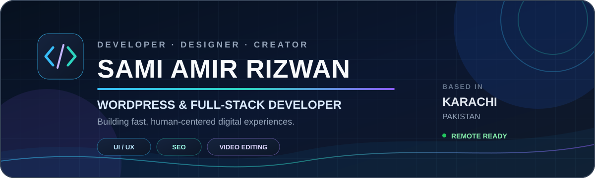

<!--
  GitHub Profile README — Sami Amir Rizwan
  Long-term maintenance:
  1. Update the "Now" and "Experience" sections when roles change.
  2. Add major launches to "Featured projects".
  3. Keep performance figures described as outcomes from selected client work.
-->

  

  
  
  
  

  <strong>WordPress Developer · Website Designer · Full-Stack Developer · UI/UX Designer · Video Editor</strong> 
  Building fast, responsive, SEO-focused digital experiences for businesses, education platforms, and creators.

---

## 👋 About me

I am a **Karachi-based developer and designer** with **5+ years of experience** creating, improving, and managing websites. My work combines **WordPress engineering, full-stack development, responsive UI/UX, performance optimization, SEO, and visual storytelling**.

I build custom WordPress experiences, WooCommerce solutions, PHP/MySQL applications, interactive front ends, and creator-focused portfolio websites. I care about clean structure, practical user journeys, reliable delivery, and websites that remain easy to maintain after launch.

### Now

- Developing and maintaining **AOSA Education**, including course discovery, tutor profiles, admissions content, responsive layouts, forms, FAQs, and conversion-focused calls to action.
- Growing two independent portfolio experiences: **ARCHANGE**, my developer portfolio, and **HanzoShaft**, my video-editing and motion portfolio.
- Completing a **Higher Diploma in Software Engineering** at Aptech Institute, Karachi, with expected graduation in **2027**.
- Open to professional **remote, freelance, and collaborative web projects**.

---

## 🧭 What I deliver

| Area | Capabilities |
|---|---|
| **WordPress engineering** | Custom themes, child themes, plugin customization, WooCommerce, Elementor, Gutenberg, maintenance, migrations |
| **Full-stack web development** | PHP, MySQL, JavaScript, REST APIs, AJAX, Node.js, Mongoose, authentication flows, reusable architecture |
| **Front-end & UI/UX** | Responsive interfaces, HTML5, CSS3, Bootstrap, Tailwind CSS, React, jQuery, accessible layouts |
| **Performance & SEO** | Page-speed optimization, caching, on-page SEO, schema markup, technical cleanup, conversion-focused structure |
| **Creative web & media** | Portfolio direction, visual systems, video-editing presentation, motion-focused experiences, creator branding |

---

## 🚀 Featured projects

<table>
  <tr>
    <td width="50%" valign="top">
      <h3>✦ ARCHANGE</h3>
      
<strong>Interactive developer portfolio</strong>

      

        A sci-fi-inspired personal portfolio with glassmorphism, responsive layouts,
        a live canvas particle system, 3D interactions, legal pages, and an interactive
        portfolio assistant.
      

      
<code>HTML5</code> <code>CSS3</code> <code>JavaScript</code> <code>GitHub Pages</code>

      
<strong>Creator credit:</strong> Designed and developed by Sami Amir Rizwan.

      

        <a href="https://samiamirrizwan.github.io/Archange/"><strong>Live site ↗</strong></a>
        ·
        <a href="https://github.com/Samiamirrizwan/Archange"><strong>Source code ↗</strong></a>
      

    </td>
    <td width="50%" valign="top">
      <h3>◆ HanzoShaft</h3>
      
<strong>Video editor & motion portfolio</strong>

      

        A YouTube-first creative portfolio featuring a showreel experience, filterable
        work, cinematic galleries, service packages, an editing workflow, video modals,
        and a protected Netlify project-brief form.
      

      
<code>Responsive Front End</code> <code>Netlify Forms</code> <code>YouTube Integration</code>

      
<strong>Creator credit:</strong> Website designed and developed by Sami Amir Rizwan.

      

        <a href="https://hanzoshaft.netlify.app/"><strong>Live site ↗</strong></a>
      

    </td>
  </tr>
  <tr>
    <td width="50%" valign="top">
      <h3>◈ SmartCareerAI</h3>
      
<strong>AI-assisted career guidance platform</strong>

      

        An Aptech group project that turns assessment results into personalized career
        suggestions, roadmaps, and mentorship connections, supported by user and admin
        workflows.
      

      
<code>PHP</code> <code>MySQL</code> <code>JavaScript</code> <code>CSS</code> <code>AI Logic</code>

      

        <a href="https://github.com/Samiamirrizwan/Vision-2025-SmartCareerAI-PHP-Project"><strong>View repository ↗</strong></a>
      

    </td>
    <td width="50%" valign="top">
      <h3>◎ AOSA Education</h3>
      
<strong>Global education and tutor-discovery platform</strong>

      

        WordPress development and ongoing maintenance for an education platform with
        language-course discovery, tutor profiles, service content, admissions journeys,
        forms, FAQs, and responsive conversion paths.
      

      
<code>WordPress</code> <code>UI/UX</code> <code>Performance</code> <code>SEO</code>

      

        <a href="https://aosa.com.pk/"><strong>Visit website ↗</strong></a>
      

    </td>
  </tr>
</table>

  
<strong>More selected builds</strong>

   

- **AttendanceOS** — Automated attendance using face recognition and QR codes, synchronized with a live 3D dashboard and automated messaging.
- **Vaccine-based Web Dashboard** — Node.js/Mongoose platform for infant immunization synchronization and clinician-led appointment recalibration.
- **Rapid Rescue Services** — Ambulance-booking portal with real-time status updates and a streamlined emergency-service interface.
- **Aptech Static Website Project** — Enhanced responsive education website created as an academic front-end project. [View repository ↗](https://github.com/Samiamirrizwan/Aptech-Website-Project-Static)
- **EduTIM LMS** — Learning-management implementation powered by Chamilo. [View repository ↗](https://github.com/Samiamirrizwan/LMS-Project-EduTIM)

---

## 💼 Experience

### WordPress Developer & Designer — AOSA Education
`July 2025 — Present · Remote`

- Develop and maintain a comprehensive education website connecting learners with tutors and study opportunities.
- Build responsive course catalogs, service pages, tutor profiles, admissions content, forms, FAQs, and clear calls to action.
- Improve usability and performance across desktop, tablet, and mobile experiences.

### WordPress Developer & Designer — Arkitektz
`October 2024 · Remote freelance`

- Created page layouts and original visual treatments for the website.
- Improved the user experience through clearer structure, styling, and interaction choices.
- Supported brand identity with custom typography and design details.

### WordPress Developer & Designer — Tutor in Dubai Education
`June 2023 — July 2023 · Remote freelance`

- Customized WordPress themes and plugins around client requirements.
- Integrated WooCommerce and payment gateways, contributing to a reported **30% increase in client sales**.
- Improved on-page SEO, security, backups, maintenance, and performance.

---

## 🛠️ Technology stack

| Focus | Tools and technologies |
|---|---|
| **CMS & commerce** | `WordPress` `WooCommerce` `Elementor` `Gutenberg` |
| **Front end** | `HTML5` `CSS3` `JavaScript` `Bootstrap` `Tailwind CSS` `React` `jQuery` |
| **Back end & data** | `PHP` `Node.js` `Python` `MySQL` `Mongoose` `REST API` `AJAX` |
| **Design** | `Figma` `Canva` `Adobe Photoshop` `Responsive UI/UX` |
| **SEO & optimization** | `On-page SEO` `Caching` `Schema Markup` `PageSpeed` `Performance Auditing` |
| **Hosting & workflow** | `Git` `GitHub` `cPanel` `Plesk` `DNS` `GitHub Pages` `Netlify` |

---

## 📈 Selected outcomes

<table>
  <tr>
    <td align="center" width="25%">
      <strong>&lt; 3 seconds</strong> 
      Optimized load times
    </td>
    <td align="center" width="25%">
      <strong>90+ scores</strong> 
      Google PageSpeed on selected sites
    </td>
    <td align="center" width="25%">
      <strong>Page 4 → Page 1</strong> 
      Reported search-ranking improvement
    </td>
    <td align="center" width="25%">
      <strong>Zero downtime</strong> 
      Selected website migrations
    </td>
  </tr>
</table>

> These figures summarize selected client-project outcomes and are not guarantees for every website.

---

## 🎓 Education & languages

| Education | Period |
|---|---|
| **Higher Diploma in Software Engineering / Inter-equivalent education** — Aptech Institute, Gulshan-e-Iqbal 2, Karachi; Sindh Board of Technical Education | `2023 — 2027 (expected)` |
| **Cambridge IGCSE O-Level** — The Hub Cadet College, Karachi | `2018 — 2023` |

**Languages:** Urdu — Native · English — Fluent

---

## 📊 GitHub snapshot

  <picture>
    <source
      media="(prefers-color-scheme: dark)"
      srcset="https://github-readme-stats.vercel.app/api?username=Samiamirrizwan&amp;show_icons=true&amp;hide_border=true&amp;rank_icon=github&amp;theme=github_dark"
    />
    <source
      media="(prefers-color-scheme: light)"
      srcset="https://github-readme-stats.vercel.app/api?username=Samiamirrizwan&amp;show_icons=true&amp;hide_border=true&amp;rank_icon=github&amp;theme=default"
    />
    
  </picture>
  <picture>
    <source
      media="(prefers-color-scheme: dark)"
      srcset="https://github-readme-stats.vercel.app/api/top-langs/?username=Samiamirrizwan&amp;layout=compact&amp;langs_count=8&amp;hide_border=true&amp;theme=github_dark"
    />
    <source
      media="(prefers-color-scheme: light)"
      srcset="https://github-readme-stats.vercel.app/api/top-langs/?username=Samiamirrizwan&amp;layout=compact&amp;langs_count=8&amp;hide_border=true&amp;theme=default"
    />
    
  </picture>

  Repository language statistics reflect public code composition, not skill level.

---

## 🤝 Connect

  <a href="https://samiamirrizwan.github.io/Archange/"><strong>Developer Portfolio</strong></a>
  ·
  <a href="https://hanzoshaft.netlify.app/"><strong>Creative Portfolio</strong></a>
  ·
  <a href="https://www.linkedin.com/in/sami-amir-rizwan/"><strong>LinkedIn</strong></a>
  ·
  <a href="mailto:sarizwan777@gmail.com"><strong>Email</strong></a>
  ·
  <a href="https://github.com/Samiamirrizwan"><strong>GitHub</strong></a>

  <em>Clean structure. Thoughtful UX. Reliable delivery.</em>

